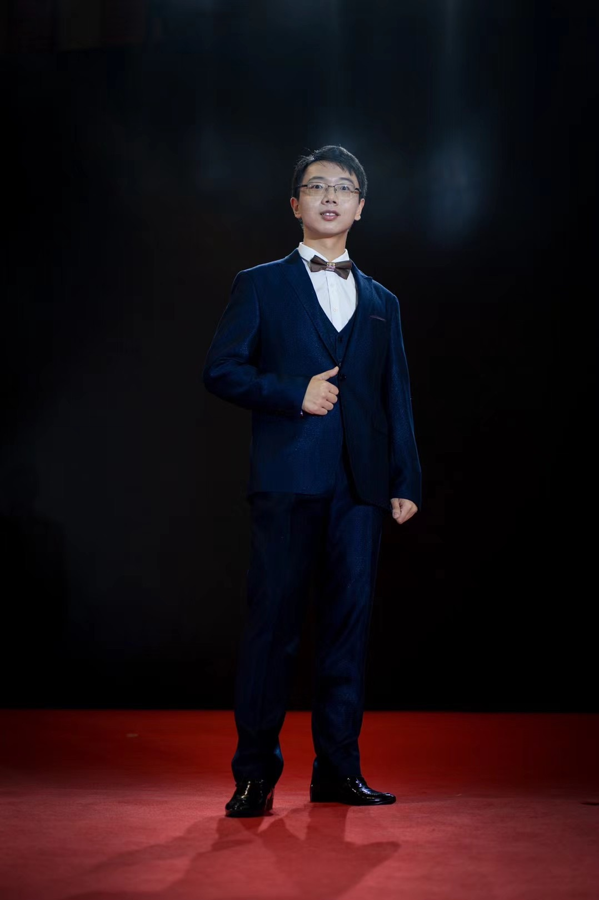

# 👤 Bio

我正在中国科学技术大学（University of Science and Technology of China）攻读计算机专业博士，我的导师是李向阳教授（ACM Fellow, IEEE Fellow）。我的研究兴趣主要在复杂网络中的计算优化，包括人工智能模型推理优化（主要方向）、物联网智能感知和智能模型安全。欢迎通过邮件与我联系。

# 🎓 Education
- **2022.09 - 至今**&emsp;中国科学技术大学 计算机学院 攻读计算机专业博士研究生
- **2020.09 - 2022.6**&emsp;中国科学技术大学 计算机学院 攻读计算机专业硕士研究生
- **2016.09 - 2020.06**&emsp;重庆大学(985) 弘深学院/计算机学院 获得计算机专业本科学位。

# 📰 News
- **[2024.12]** 🎉 我们与蔚来汽车公司的合作项目圆满结束，我以第一作者发表论文工作被**CCF A类会议AAAI**录用！
- **[2024.12]** 🎉 我以共同一作身份在**CCF A类会议INFCOM**上发表论文，感谢Bowen Zhang、Jiahui Hou等所有作者的努力！
- **[2024.11]** 🎉 在 **泛在智能感知技术创新应用大赛** 中获得三等奖。
- **[2024.10]** 🎉 我以合作者身份参与**CCF A类中文期刊计算机学报**上发表一篇论文，感谢老师的指导和每一位同学的努力！
- **[2024.08]** 🎉 我以第一作者身份在**CCF A类期刊TMC**上发表一篇论文，感谢老师的指导和同学的帮助！

# 📚 Publications
1. [AAAI'25 Oral] **A-VL: Adaptive Attention for Large Vision-Language Models.**  
   **Junyang Zhang**, Mu Yuan, Ruiguang Zhong, Puhan Luo, Huiyou Zhan, Ningkang Zhang, Chengchen Hu, Xiangyang Li. 
   *The 39th Annual AAAI Conference on Artificial Intelligence* **(AAAI 2025, CCF-A)**

2. [INFOCOM'25] **TensAllo: Adaptive Deployment of LLMs on Resource-Constrained Heterogeneous Edge Devices.**  
   Bowen Zhang, **Junyang Zhang(共同一作)**, Jiahui Hou and Yixin Wang. 
   *IEEE Conference on Computer Communications* **(IEEE INFOCOM, CCF-A)**

3. [TMC'24] **WordWhisper: Exploiting Real-Time, Hardware-Dependent IoT Communication Against Eavesdropping.**  
   **Junyang Zhang**; Jiahui Hou; Ye Tian; Xiang-Yang Li. 
   *IEEE Conference on Computer Communications* **(IEEE TMC, CCF-A)**

4. [计算机学报] **面向智能物联网的资源高效模型推理综述**  
   袁牧，张兰，姚云昊，**张钧洋**，罗溥晗，李向阳.
   *CHINESE JOURNAL OF COMPUTERS 计算机学报* **(中文CCF-A)**

5. [PrePrint] **PICE: A Semantic-Driven Progressive Inference System for LLM Serving in Cloud-Edge Networks.**  
   Huiyou Zhan, Xuan Zhang, Haisheng Tan, Han Tian, Dongping Yong, **Junyang Zhang**, Xiang-Yang Li.
   *arXiv*
 
6. [PrePrint] **DERMARK: A Dynamic, Efficient and Robust Multi-bit Watermark for Large Language Models.**  
   Qihao Lin, Chen Tang, Lan zhang, **Junyang zhang**, Xiangyang Li.
   *arXiv* 

# 📝 Research

### 模型推理优化

模型推理优化（主要研究方向）：关注深度学习模型在实际应用落地时的性能瓶颈，提高深度学习模型的推理效率、降低计算成本、减少延迟，并在保持或提升准确率的前提下优化资源利用，实现降本增效。
- 【应用项目】华为端侧AI能效比提升校企合作项目、蔚来智能座舱校企合作项目
- 【论文一作】【CCF A】A-VL: Adaptive Attention for Large Vision-Language Models
- 【论文共一】【CCF A】TensAllo: Adaptive Deployment of LLMs on Resource-Constrained Heterogeneous Edge Devices
- 【论文合作】PICE: A Semantic-Driven Progressive Inference System for LLM Serving in Cloud-Edge Networks
- 【论文合作】【CCF A】面向智能物联网的资源高效模型推理综述

### 智能感知

智能感知：人工智能与信息感知技术的深度融合，利用无线信号进行环境感知、目标检测和行为识别的技术，突破了传统传感器对光照、可视角度等限制，具备低功耗、非接触、高精度的优势。智能感知往往能通过常见的无线信号建立人体无感的、意想不到的感知信道，灵感先行、创意无限！
- 【论文一作】【CCF A】WordWhisper: Exploiting Real-Time, Hardware-Dependent IoT Communication Against Eavesdropping

### 模型安全

模型推理安全：模型推理安全可以分为推理前（输入安全）、推理中（权重安全）和推理后（输出安全）。而从目标上来看，又分为计算过程中的全程数据保护（私密）和计算结束后的鉴权溯源（公开）。我和我的合作伙伴主要关注于智能模型计算后的鉴权溯源，保护各方的合法利益。
- 【论文合作】DERMARK: A Dynamic, Efficient and Robust Multi-bit Watermark for Large Language Models

# 🌏 Service
- 课程助教：2023年担任中科大研究生课程“计算机应用数学”的助教；
- 组织工作：担任研究生智能物联党支部组织委员；
- 志愿活动：图灵大会志愿者、学院晚会志愿者等等……

# 💫 Hobbies

除了日常生活，我也喜欢摄影、音乐、主持、游戏，欢迎交流。我喜欢健身，但也喜欢美食，这两个爱好的效果经常互相抵消。我还喜欢折腾各种稀奇古怪的代码项目，自己想实现某些东西的coding是一种享受。既要努力工作、也要享受生活，螺旋上升方为持久之道。

<!-- 整体容器，宽度90%居中 -->
  

    <!-- 第一行：两张图片（60%和30%），两者之间留出10%的间隔 -->
    

      <!-- 第一张图片：60% -->
      

        <!-- 图片裁剪容器：利用 padding-top 设置固定比例（这里采用16:9，56.25%） -->
        

          
        

        <!-- 图片说明 -->
        
摄影

      

      <!-- 第二张图片：30% -->
      

        

          
        

        
摄影

      

    

    <!-- 第二行：一张100%宽的图片 -->
    

      

        

          
        

        
摄影

      

    

    <!-- 第三行：三张图片，每张30%，第一二张右侧各留5%的间隔 -->
    

      <!-- 第一张图片：30%，右侧间隔5% -->
      

        

          
        

        
摄影

      

      <!-- 第二张图片：30%，右侧间隔5% -->
      

        

          
        

        
我的吉他

      

      <!-- 第三张图片：30% -->
      

        

          
        

        
主持晚会

      

    

  

